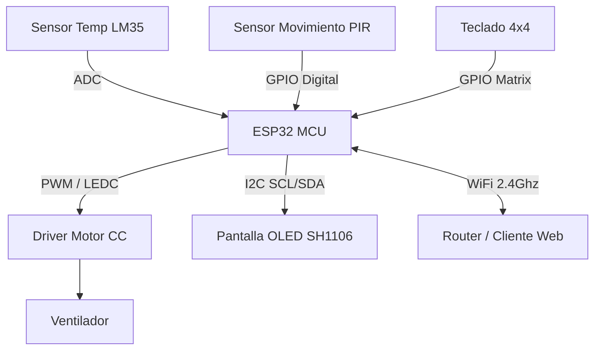

# 📄 INFORME TÉCNICO: Ventilador Inteligente (ESP32)

## 1. 👥 Información General del Proyecto

| Campo | Detalle |
| :--- | :--- |
| **Título del Proyecto** | Ventilador Inteligente con Control Web, Modos Automáticos y OTA |
| **Integrantes** | **Jhonatan Yara Lopez** |
| | **Edwin Santiago Rodriguez Daza** |
| **Asignatura** | Estructuras Computacionales |
| **Plataforma** | ESP-IDF (FreeRTOS en ESP32) |
| **Fecha de Entrega** | 8 de diciembre |

---

## 2. 🏛️ Arquitectura de Hardware

### 2.1. Componentes Físicos

El sistema está diseñado para el control domótico de un ventilador, integrando múltiples sensores para un funcionamiento autónomo, una interfaz local para el usuario y conectividad Wi-Fi para gestión remota.

* **Microcontrolador (MCU):** **ESP32**. Seleccionado por su conectividad Wi-Fi/Bluetooth integrada y su potencia para manejar múltiples periféricos y un servidor web simultáneamente.
* **Actuador de Velocidad:** Control de motor basado en **PWM (Pulse Width Modulation)** utilizando el periférico LEDC del ESP32. Esto permite un control granular de la velocidad del ventilador de 0% a 100%.
* **Sensores:**
  * **Sensor de Temperatura (LM35):** Sensor analógico para medir la temperatura ambiente en tiempo real, utilizado para el modo de control automático.
  * **Sensor de Movimiento (PIR):** Sensor digital para detectar presencia humana.
* **Interfaz Humano-Máquina (HMI) Local:**
  * **Pantalla OLED (SH1106):** Pantalla gráfica conectada vía I2C para mostrar el estado del sistema, temperatura, velocidad actual y retroalimentación.
  * **Teclado Matricial (3x4):** Permite la entrada manual de datos, específicamente para autenticación local.
* **Almacenamiento:** Memoria Flash del ESP32, particionada para soportar NVS y particiones OTA.

### 2.2. Diagrama de Bloques del Hardware

## 3. 💾 Arquitectura de Firmware

El firmware se construyó utilizando ESP-IDF, basado en FreeRTOS para manejar concurrencia y varias funcionalidades del sistema.

### 3.1. Estructura de Tareas (FreeRTOS)

Tareas principales del sistema:

**control_logic_task (Tarea Principal):**
- Lee sensores (Temperatura y PIR).
- Evalúa modo de operación actual.
- Aplica la lógica de control.
- Actualiza la pantalla OLED.

**http_server_task:**
- Atiende peticiones HTTP.
- Sirve la interfaz web.
- Maneja endpoints/API REST.

**keypad_task:**
- Escanea el teclado matricial.
- Envía eventos por cola.

**Tareas de Sistema (WiFi/LwIP):**
- Manejan la conexión Wi-Fi y pila TCP/IP.

### 3.2. Modos de Operación

**MODO MANUAL:**  
El usuario fija velocidad desde la web.

**MODO AUTO:** Basado en temperatura:
- Temp < Tmin → apagado/min.
- Temp > Tmax → 100%.
- Entre rangos → interpolación lineal.

**MODO PROGRAMADO:**  
Enciende solo en un rango horario.

---

## 4. 🌐 Interfaz Web y API REST (HTTP)

El ESP32 funciona como servidor HTTP local, sin broker externo.

### 4.1. Servidor Web Embebido

Sirve un archivo `index.html` almacenado en la memoria Flash del ESP32.

### 4.2. API REST

| Método | Endpoint | Descripción | Ejemplo JSON |
|--------|----------|-------------|---------------|
| **GET** | `/api/status` | Estado completo del sistema. | `{"temp":25.5,"speed":80,"motion":1,"mode":1}` |
| **POST** | `/api/settings` | Actualiza configuración general. | `{"mode":1,"manualSpeed":50,"tempMin":20,"tempMax":30}` |
| **POST** | `/ota` | Recibe un archivo .bin para actualización OTA. | (datos binarios) |

---

## 5. 🔄 Actualización OTA y Gestión de Memoria

### 5.1. OTA HTTP

El ESP32:
- recibe `.bin`,
- escribe en la partición OTA inactiva,
- verifica integridad,
- reinicia con nuevo firmware.

### 5.2. Esquema de Particiones

- **NVS:** Configuración persistente.
- **OTADATA:** Gestor de OTA.
- **APP0 (ota_0):** Firmware activo.
- **APP1 (ota_1):** Destino OTA.

Recomendado: flash de 4MB y compilación con `-Os`.

---

## 6. 🛡️ Seguridad y Wi-Fi

### WiFi (AP + STA):

- **SoftAP** si no hay credenciales.
- **STA** para operación normal.

### Seguridad Local (Teclado):

- Contraseña numérica de 4 dígitos.
- Verificación contra hash en NVS.
